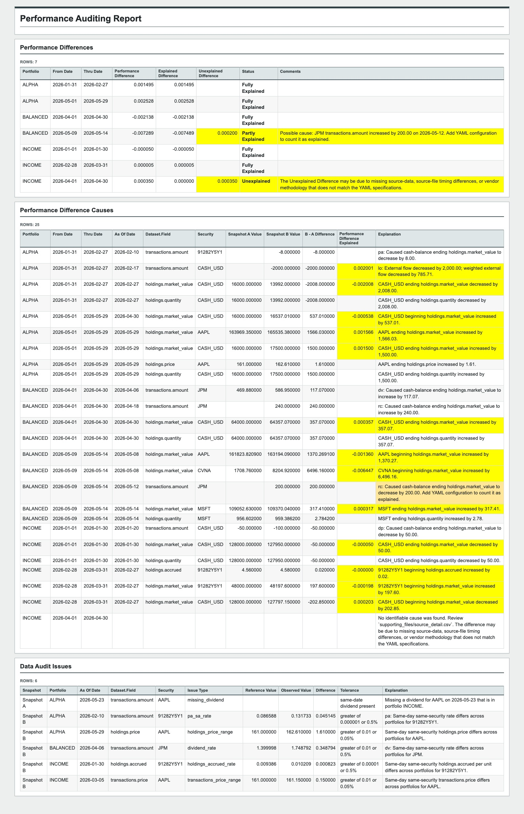

# PPAR Audit

**Explain why reported portfolio performance changed.**

PPAR Audit answers a difficult operational question: "Why did my reported portfolio
performance change?" It compares two portfolio-accounting snapshots, quantifies
supported causes across holdings, transactions, prices, FX, and related data, flags
suspicious source-data relationships, and produces reviewer-ready Excel and HTML
reports. When the available evidence is insufficient, the unexplained difference
stays visible for human review.

- Everything runs locally, so portfolio data stays inside your environment.
- The Python implementation supports automated batch runs and local customization.
- Standard output includes XLSX, HTML, CSV, JSON, and compact evidence bundles.

[Download the product overview (PDF)](PPAR.pdf) | [License](LICENSE)

Downloading, installing, accessing, copying, or using PPAR constitutes
acceptance of the license. The public package grants a time-limited internal
evaluation license only; production and other commercial use require a separate
written commercial agreement.

---

## What PPAR Audit Answers

PPAR Audit is built around one operational question:

> **Why did my reported performance change?**

- **Performance Comparison:** identifies changed portfolio and security performance
  for each time period, quantitatively attributes defensible differences to supported
  source-data changes, and highlights anything that still needs human review.
- **Data Issues:** flags suspicious source-data relationships — including price
  ranges, dividend rates, accrued-interest rates, and missing dividends — that may
  indicate data-quality issues independently of the performance explanation.



---

## Setup

Install the PPAR package:

```bash
pip install ppar
```

Create a local PPAR Audit workspace. The workspace includes PPAR-normalized
demonstration data modeled on Axys/APX source and report data, so you can run the
complete workflow before replacing the CSV files with reviewed exports from your
own environment.

```bash
ppar setup ./my_ppar_audit
```

Run Audit:

```bash
ppar audit ./my_ppar_audit
```

Follow the `Customizing With Your Own Data` section in
`./my_ppar_audit/README.md` when you are ready to customize the workspace with
your own data.

```text
my_ppar_audit/
  README.md
  ppar.yaml
  run_audit.py
  snapshot_a/
    portperf.csv
    holdings.csv
    transactions.csv
    secmast.csv
    secperf.csv
    splits.csv
  snapshot_b/
    portperf.csv
    holdings.csv
    transactions.csv
    secmast.csv
    secperf.csv
    splits.csv
```

---

## Inputs

The demonstration files are PPAR-normalized CSVs modeled on Axys/APX data.
Production inputs may come from reviewed REP, IMEX, custom-report, or other
controlled exports:

- portfolio performance;
- security performance;
- holdings;
- transactions;
- security master data;
- split factors.

Audit uses two source-data snapshots. Snapshot A is normally the older or original
state and Snapshot B is normally the newer or restated state, but neither snapshot
is presumed correct.

PPAR normalizes those files through a customizable `ppar.yaml` file, so each site
can configure its local field names, transaction-code treatment, comparison
tolerances, and report assumptions. The setup-created file documents these choices
in place.

The configured file and accounting contracts fail closed when required source
treatment is missing or ambiguous. Optional evidence does not silently expand the
calculation or policy surface.

---

## Outputs

PPAR Audit writes review packages:

```text
output/
  portfolio/
    portfolio_audit.xlsx
    portfolio_audit.html
    source_detail.csv
    audit_support.zip
  security/
    security_audit.xlsx
    security_audit.html
    source_detail.csv
    audit_support.zip
```

To prevent unusably large artifacts, Audit stops with a nonzero exit code before
writing a report when any primary review table would exceed 100,000 rows. The error
identifies the oversized table and its largest contributors so the user can narrow
the portfolio or date scope or correct upstream differences.

---

## Current Validation Scope

PPAR Audit has substantial automated coverage, financial invariants, report
reconciliation checks, output-integrity checks, deterministic demonstrations, and
maintained scale gates.

It has not yet been validated against a real client's production-style Axys/APX
exports and approved local accounting policy. The current program is seeking a
small number of strong validation partners to test source authenticity, setup
burden, financial interpretation, false positives, and reviewer usefulness.

PPAR Audit detects, compares, explains, and helps investigate supported
portfolio-performance and source-data differences. It does not provide a
financial-statement audit, GIPS verification, attestation, certification, or
assurance opinion.

---

## Additional Repository Capability

This repository also contains
[`ppar.analytics`](docs/analytics/README.md), a maintained module for
benchmark-relative performance attribution, contribution, and ex-post risk
reporting. It is retained for future PPAR packaging but is not part of the current
PPAR Audit validation program or default onboarding workflow.
