# portfolio-performance-analytics
portfolio-performance-analytics (ppar) is a python package that produces holdings-based multi-period performance attribution, contribution, and benchmark-relative ex-post risk statistics.

[License](LICENSE)

## Table of Contents

- [Description](#description)
- [Features](#features)
- [Inputs](#inputs)
- [Outputs](#outputs)
- [Installation](#installation)
- [Usage](#usage)
- [Performance Comparison](#performance-comparison)
- [Repository Guide](#repository-guide)
- [Technical](#technical)
- [Enhancements](#enhancements)
- [Support](#support)

---

## Description

portfolio-performance-analytics is a python package (https://pypi.org/project/ppar/) that produces holdings-based multi-period performance attribution, contribution, and benchmark-relative ex-post risk statistics. It uses the Brinson-Fachler methodology for calculating attribution effects, and uses the Carino method for logarithmically-smoothing cumulative effects over multi-period time frames.

---

## Features

The below sample outputs portray a large-cap alpha strategy that has achieved a high active return of 1737 bps over the benchmark.  In the total lines of the Economic Sector Attribution reports, you can see that this active return can be broken down into 359 bps in sector allocation and 1378 bps in selecting securities.  From the Risk Statistics report, you can see that this has been accomplished with a lower downside probabilty than the benchmark (29% vs 36%), and a higher annualized sharpe ratio than the benchmark (2.02 vs 1.27).  The largest contributor to active performance was in the Information Technology Sector.  Although the portfolio was slightly under-allocated in the Information Technology sector (by -0.05%), it did an excellent job of selecting securities for a total active contribution of 431 bps in the sector.

<!--
Image sources are repository-relative so they render for authorized GitHub
viewers when this repository is private. PyPI cannot render these private
assets; public image URLs are required there if image display is needed.
-->

- **Attribution & Contribution**:
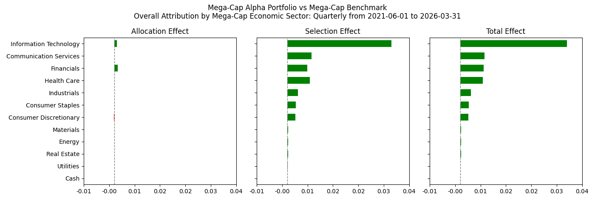
<br><br><br>
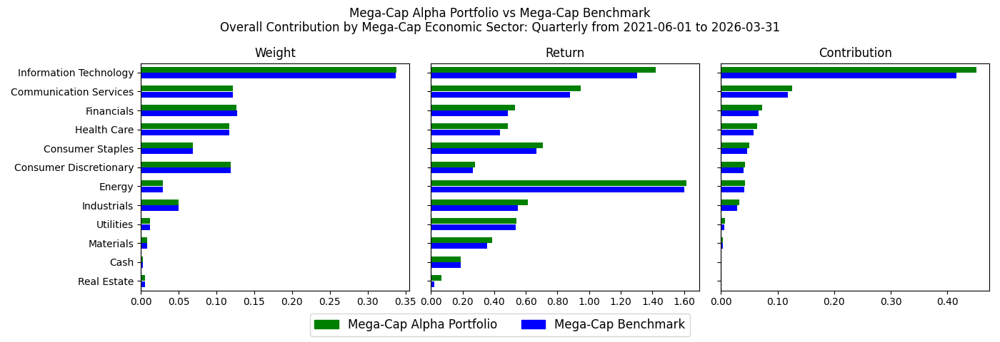
<br><br><br>
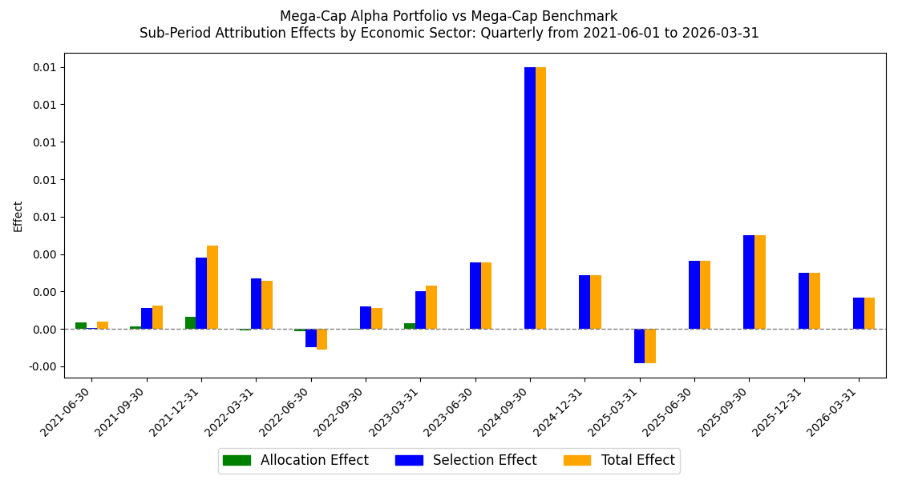
<br><br><br>
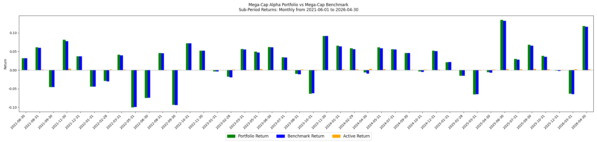
<br><br><br>
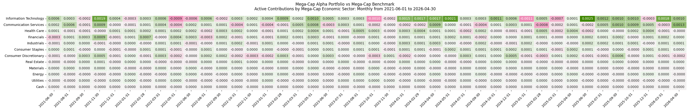
<br><br><br>

<br><br><br>
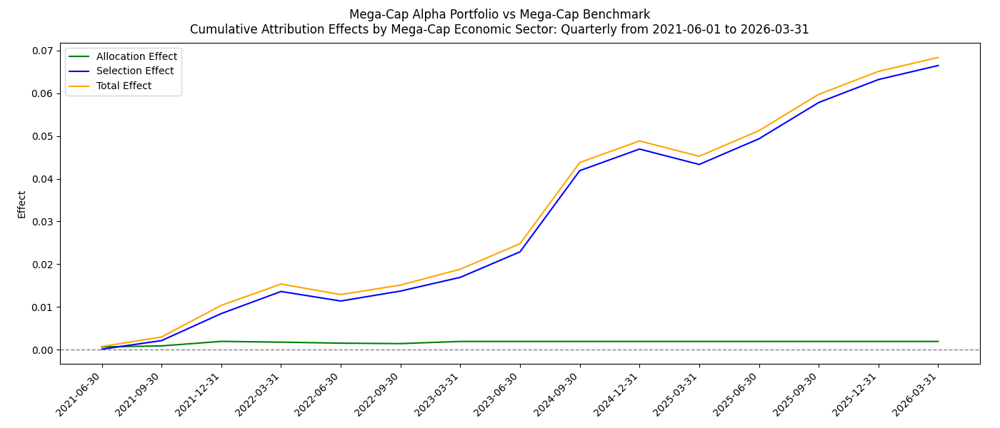
<br><br><br>
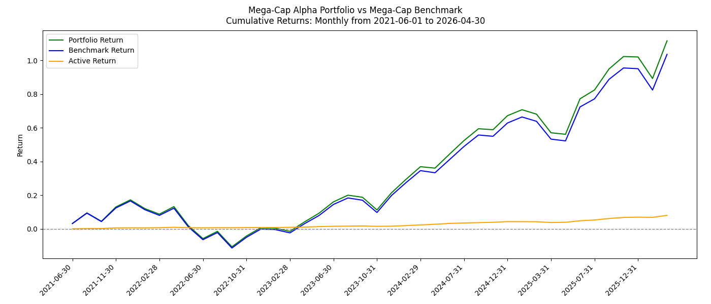
<br><br><br>
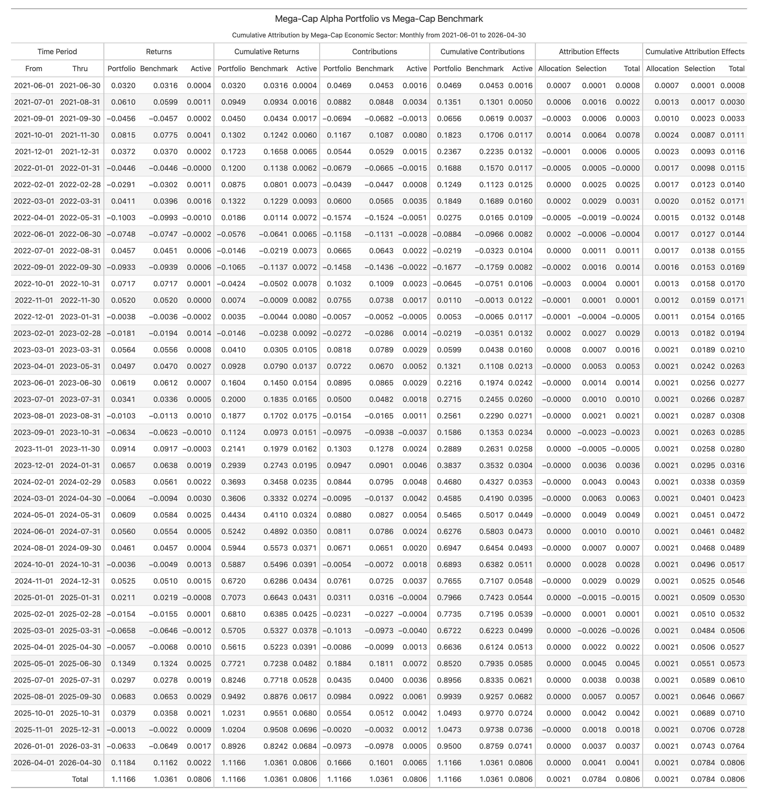
<br><br><br>
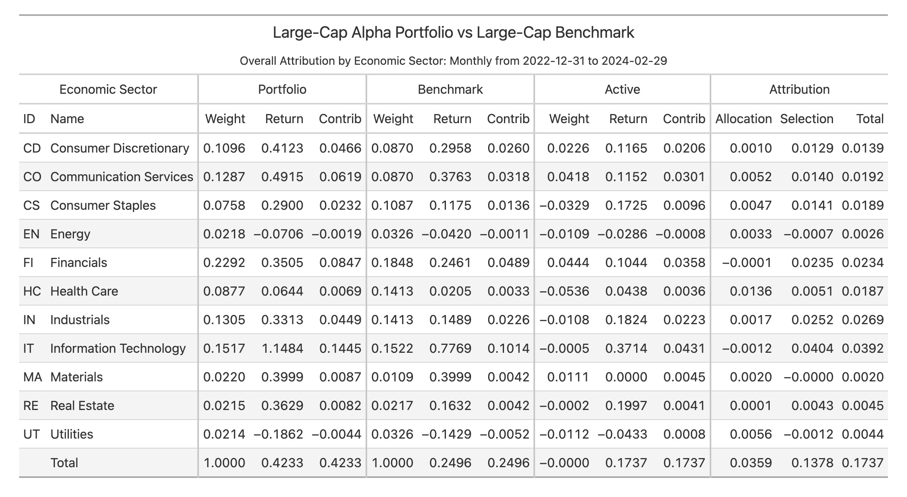
<br><br><br>
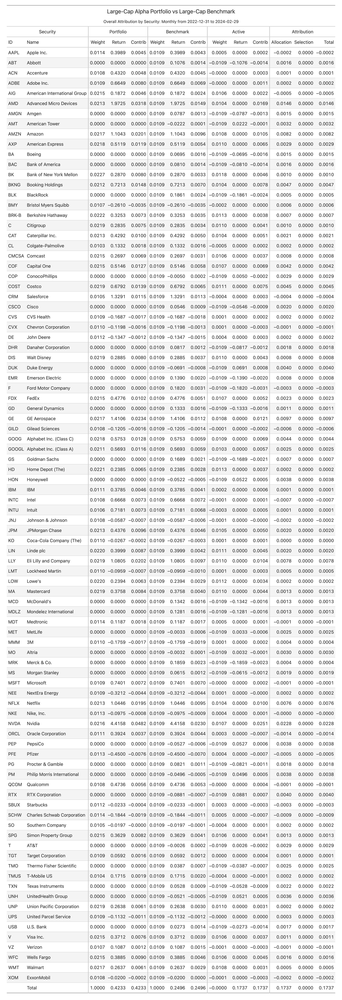
<br><br><br>

- **Ex-Post Risk Statistics**:
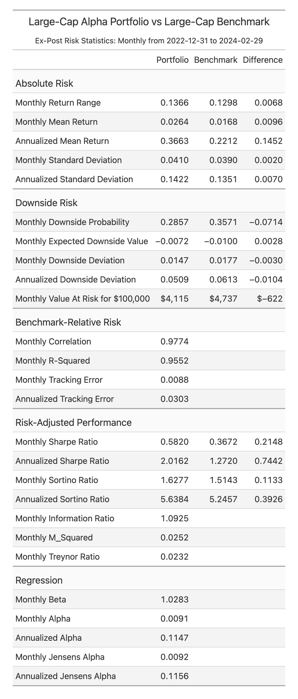
<br>

---

## Inputs

The inputs required to produce the analytics fall into three categories:
1. Periodic "classification-level" weights and returns for a portfolio and its benchmark.  A "classification" can be any category such as region, country, economic sector, industry, security, etc.  The weights and returns must satisfy the formula: *SumOf(weights * returns) = Total Return*. They will typically be from-of-period weights and period returns. (Required)
2. Classification items and descriptions. (Optional)
3. Mappings from the classification scheme of the weights and returns to a reporting classification. (Optional)

The input data may be provided directly as either:
1. Pandas DataFrames.
2. Polars DataFrames.
3. Python dictionaries (for Classifications and Mappings).
4. csv files.

Portfolio and benchmark performance sources use narrow rows. The `name` column
is optional; `contribution` and total return are calculated by the package.

```csv
from_date,thru_date,identifier,weight,return,name
2023-12-31,2024-01-31,AAPL,0.4,-0.0422272121,Apple Inc.
2023-12-31,2024-01-31,MSFT,0.6,0.0572811503,Microsoft
```

Wide performance files with per-identifier columns such as `AAPL.ret` and
`AAPL.wgt` are not supported.

For sample input data sources, please refer to the ``ppar-analytics-demo``
command and the ppar/demo_data directory. Once the input data has been
provided, then the analytics may be requested using different calculation
parameters, time-periods, and frequencies:
1. Daily (or for whatever data frequency is provided).
2. Monthly
3. Quarterly
4. Yearly

Typically, a user will develop their own "data source" functions that provide
the data in one of the above formats. The ``ppar-analytics-demo`` command uses
sample data source functions.

---

## Outputs

The outputs are represented by different views and charts.  See [Features](#features) above.  They may be delivered in different formats:
1. csv files
2. html strings
3. json strings
4. Pandas DataFrames
5. png files
6. Polars DataFrames
7. Lightweight Python HTML table objects
8. xml strings

The ``to_html()`` methods return complete HTML document strings. The ``to_table()`` methods return lightweight table objects whose ``as_raw_html()`` method can emit either a complete HTML document or a table fragment. Users can also develop their own "presentation layer" using the various output formats as the inputs to their presentation layer.

---

## Installation
pip install ppar

For chart output, including the chart option in ``ppar-analytics-demo``:
```
pip install "ppar[charts]"
```

---

## Usage
Run the bundled demos from an installed environment:

```bash
ppar-analytics-demo
ppar-axys-analytics-demo
ppar-performance-comparison-demo
ppar-performance-comparison-validate-config
```

---

## Performance Comparison

The performance comparison feature compares two source-data snapshots and helps
explain why reported portfolio performance changed between extraction dates. It
loads normalized portfolio performance, security performance, transactions,
positions, prices, FX rates, cash, and security-reference data; emits stable
findings; and writes reviewer-oriented Markdown, HTML, CSV, optional XLSX, and
bundle outputs.

Start with these references instead of treating this root README as the full
manual:

- [Repository Guide](docs/repository_guide.md) for a high-level map of the
  README files, scripts, demos, test fixtures, validators, and generated
  outputs.
- [Performance Comparison Design Notes](docs/performance_comparison_design.md)
  for the feature model, current implementation checkpoint, YAML semantics, and
  report bundle shape.
- [Packaged Axys Demo Matrix](ppar/demo_data/axys/README.md) for exact demo
  YAML files, XLSX workbook commands, and expected outputs.
- [Axys Common-Core Export Reference](docs/axys_common_core_export.md) for a
  starter Axys export template and field-reference tables.
- [Axys test data notes](tests/data/axys/README.md) for the synthetic fixture
  layouts used by demos and tests.

To smoke-test the default performance comparison demo from a source checkout:

```bash
./.venv/bin/python -m ppar.demos.performance_comparison_demo
./.venv/bin/python scripts/performance_comparison_validate_bundle.py \
  _demo_output/performance_comparison_bundle
./.venv/bin/python scripts/performance_comparison_validate_demo_matrix.py
```

Then open `_demo_output/performance_comparison_bundle/report.html`. Generated
output under `_demo_output/` is intentionally ignored by Git.

XLSX workbook export is optional. Install the Excel extra and pass
`--include-workbook` to one of the packaged workbook demo commands. For XLSX
demos, start review in `review_workbook.xlsx`; use `report.html` as a secondary
browser-friendly narrative view.

```bash
./.venv/bin/python -m pip install -e ".[excel]"
./.venv/bin/python scripts/performance_comparison_report_bundle.py \
  ppar/demo_data/axys/ppar_performance_comparison_restatement.yaml \
  _demo_output/workbooks/single_restatement \
  --include-workbook
./.venv/bin/python scripts/performance_comparison_validate_bundle.py \
  _demo_output/workbooks/single_restatement
```

Use the [Repository Guide](docs/repository_guide.md) for the full script and
validator map. Use the [Packaged Axys Demo Matrix](ppar/demo_data/axys/README.md)
for the workbook demo commands and what each workbook should contain.

---

## Repository Guide

If the README files, demo fixtures, scripts, validators, and tests start to feel
too scattered, start with the [Repository Guide](docs/repository_guide.md). It
maps the major directories, explains which README owns which topic, summarizes
the source-checkout scripts and installed commands, and gives common workflows
for generating and validating performance comparison reports and XLSX
workbooks.

---

## Technical
Being built on top of Polars dataframes, ppar is able to efficiently process large datasets through parallel processing, vectorization, lazy evaluation, and using Apache Arrow as its underlying data format.

Run local project checks from a source checkout with the repository virtual
environment:

```bash
./.venv/bin/python scripts/check_project.py
```

For faster routine feedback during small changes:

```bash
./.venv/bin/python scripts/check_project.py --quick
```

To include a temporary wheel and source-distribution build check:

```bash
./.venv/bin/python scripts/check_project.py --build
```

---

## Enhancements
Future enhancements may include:
1. Break out the interaction (cross-product) effect.  It is currently included in the selection effect.
2. Break out the currency effect.
3. Break out the long and short sides.
4. Add additional multi-period smoothing algorithms (e.g. Menchero).
5. Support time-series of risk-free rates (as opposed to a single annual rate).
6. Calculate additional risk statistics.

---

## Support
If you find this project helpful, consider sponsoring it at https://github.com/sponsors/JohnDReynolds to help keep it going!
