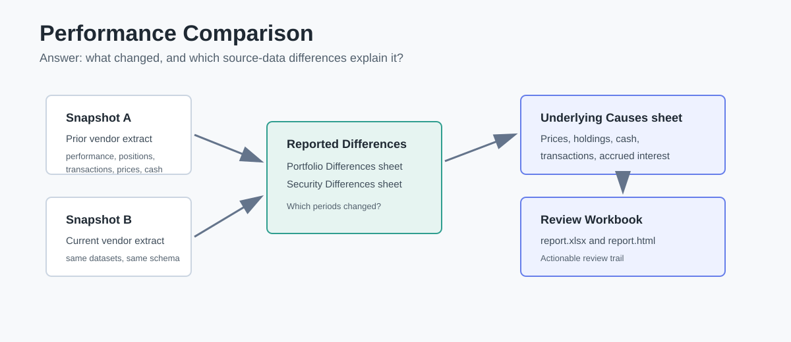

# Portfolio Performance Analytics

Portfolio Performance Analytics (`ppar`) is a Python package for explaining
investment performance. It has two main workflows:

| Feature | Question It Answers |
| --- | --- |
| **Analytics** | Why did this portfolio outperform or underperform its benchmark? |
| **Performance Comparison** | Why did reported performance change between two source-data snapshots? |

[License](LICENSE)

## Table Of Contents

- [Installation](#installation)
- [Analytics](#analytics)
- [Performance Comparison](#performance-comparison)
- [Vendor Support](#vendor-support)
- [Documentation](#documentation)
- [Project Checks](#project-checks)

## Installation

```bash
pip install ppar
```

For chart rendering support:

```bash
pip install "ppar[charts]"
```

## Analytics

The analytics workflow explains portfolio performance versus a benchmark using
holdings-based attribution, contribution, and ex-post risk statistics.

`ppar` supports:

- Brinson-Fachler attribution effects.
- Carino smoothing for multi-period attribution.
- Contribution analysis.
- Benchmark-relative ex-post risk statistics.
- Monthly, quarterly, yearly, or source-period reporting.
- CSV, HTML, JSON, PNG, Pandas, Polars, and lightweight HTML-table outputs.

### Example: Mega-Cap Alpha Portfolio

The analytics demo shown below compares a Mega-Cap alpha portfolio against a
Mega-Cap benchmark from June 2021 through March 2026.

Over the full period, the portfolio returned 89.3% versus 82.4% for the
benchmark, producing an active return of about 684 bps. The Economic Sector
Attribution reports explain most of that active return through security
selection: about 19 bps from sector allocation and about 665 bps from security
selection. Information Technology was the largest source of active performance,
contributing about 351 bps of total attribution effect.

The Risk Statistics report shows a modest risk-adjusted advantage: annualized
Sharpe ratio of 0.70 for the portfolio versus 0.67 for the benchmark, and
annualized Sortino ratio of 1.82 versus 1.74.

<!--
Image sources are repository-relative so they render for authorized GitHub
viewers when this repository is private. PyPI cannot render these private
assets; public image URLs are required there if image display is needed.
-->


<br>


<br>


<br>


### Run The Analytics Demo

```bash
ppar-analytics-demo
```

The demo writes tables and charts to:

```text
_demo_output/analytics
```

The analytics demos default to quarterly reporting. Pass any value beginning
with `m`, `q`, or `y` to select monthly, quarterly, or yearly reporting:

```bash
ppar-analytics-demo --frequency monthly
ppar-analytics-demo --frequency quarterly
ppar-analytics-demo --frequency yearly
```

### Analytics Inputs

Portfolio and benchmark performance sources use narrow rows. The `name` column
is optional; contribution and total return are calculated by the package.

```csv
from_date,thru_date,identifier,weight,return,name
2023-12-31,2024-01-31,AAPL,0.4,-0.0422272121,Apple Inc.
2023-12-31,2024-01-31,MSFT,0.6,0.0572811503,Microsoft
```

Inputs may be provided as CSV files, Pandas DataFrames, Polars DataFrames, or
Python dictionaries for classifications and mappings.

## Performance Comparison

The performance comparison workflow compares two source-data snapshots and
explains why reported performance changed between extraction dates.

It can compare:

- Portfolio-period performance.
- Security-period performance.
- Holdings, market values, quantities, accrued interest, and cash.
- Transactions, prices, FX rates, and security-reference data.

The output is a review bundle with `report.xlsx`, `report.html`, CSV audit
files, and a manifest. Start review in the generated Excel workbook.



### Portfolio-Level Demo

```bash
ppar-performance-comparison-portfolio-demo
```

Output:

```text
_demo_output/performance_comparison_portfolio/report.xlsx
_demo_output/performance_comparison_portfolio/report.html
```

### Security-Level Demo

```bash
ppar-performance-comparison-security-demo
```

Output:

```text
_demo_output/performance_comparison_security/report.xlsx
_demo_output/performance_comparison_security/report.html
```

### Review Workflow

1. Open `report.xlsx`.
2. Start with the `Portfolio Differences` or `Security Differences` sheet.
3. Use the `Underlying Causes` sheet to see which input differences explain the
   reported performance difference.
4. Use `Required YAML Setup` when the workbook needs explicit attribution rules
   before it can calculate an explanation.

### Performance Comparison Resources

- [Packaged Axys Demo Data](ppar/demos/data/axys/README.md): demo commands,
  data used, YAML setup, and expected workbook output.
- [Performance Comparison Design Notes](docs/performance_comparison_design.md):
  model details, YAML vocabulary, and workbook/report design notes.
- [Axys Common-Core Export Reference](docs/axys_common_core_export.md): starter
  Axys export template and field-reference tables.

## Vendor Support

The core analytics model is vendor-neutral. Vendor interfaces adapt exported
vendor files into the same internal analytics and comparison workflows.

### Axys Analytics Demo

```bash
ppar-axys-analytics-demo
```

The Axys analytics demo reads Axys-shaped exports for the same Mega-Cap Alpha
portfolio and benchmark used by `ppar-analytics-demo`, then renders the same
analytics output model.

Output:

```text
_demo_output/axys_analytics
```

Frequency selection works the same way:

```bash
ppar-axys-analytics-demo --frequency monthly
ppar-axys-analytics-demo --frequency quarterly
ppar-axys-analytics-demo --frequency yearly
```

The performance comparison demos also use Axys-shaped source data. See the
[Axys Common-Core Export Reference](docs/axys_common_core_export.md) for the
starter export shape.

## Documentation

- [Repository Guide](docs/repository_guide.md): project map, demo commands,
  generated outputs, and common workflows.
- [Analytics Demo Refresh](docs/analytics_demo_refresh.md): how to regenerate
  the Mega-Cap demo data and README images.
- [Performance Comparison Design Notes](docs/performance_comparison_design.md):
  detailed model and workbook design notes.
- [Axys Common-Core Export Reference](docs/axys_common_core_export.md): vendor
  export template and field reference.

## Project Checks

From a source checkout with the repository virtual environment:

```bash
./.venv/bin/python scripts/check_project.py --quick
./.venv/bin/python -m pytest -q
```
