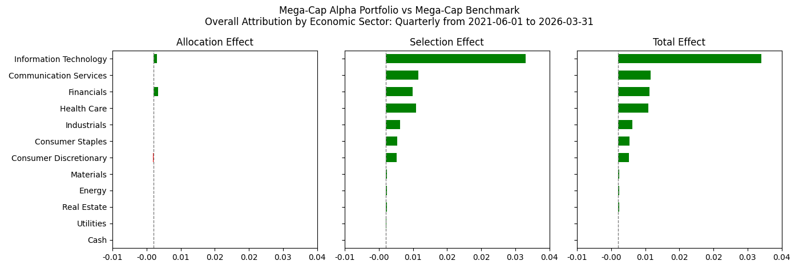
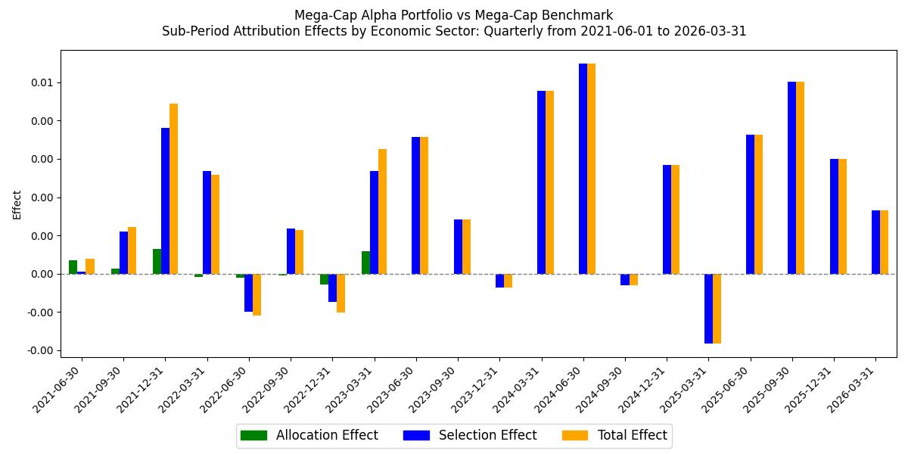
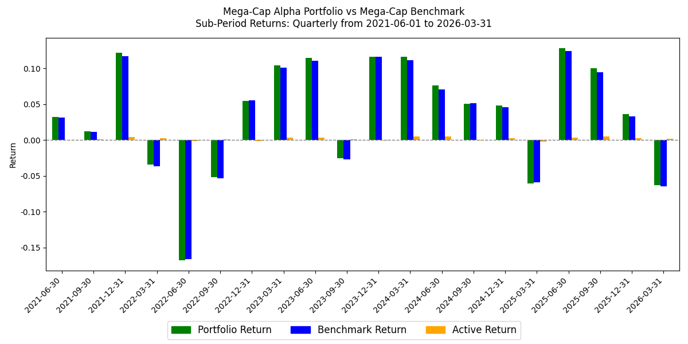
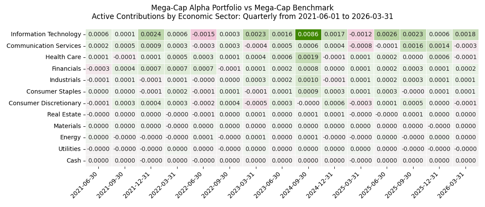
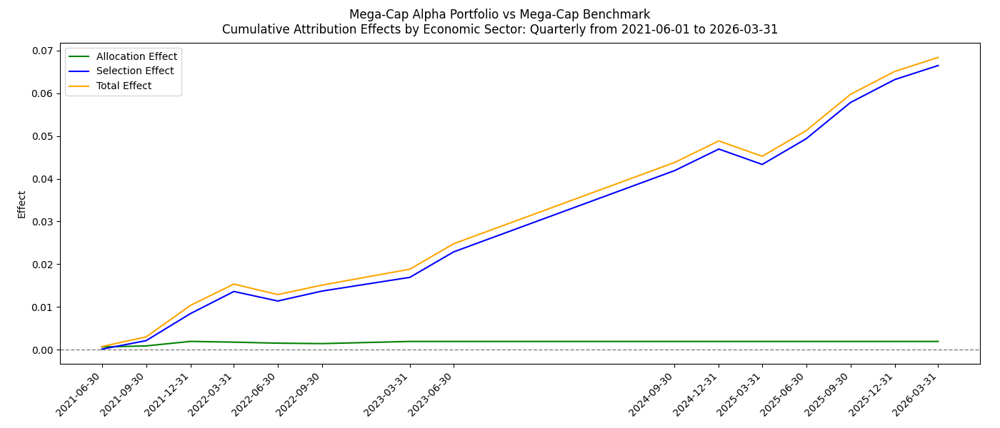
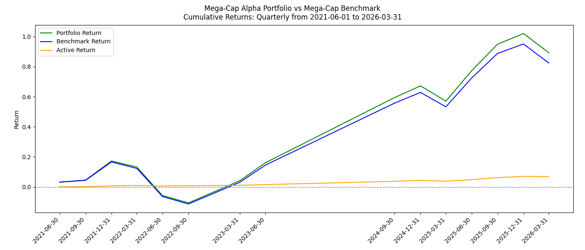
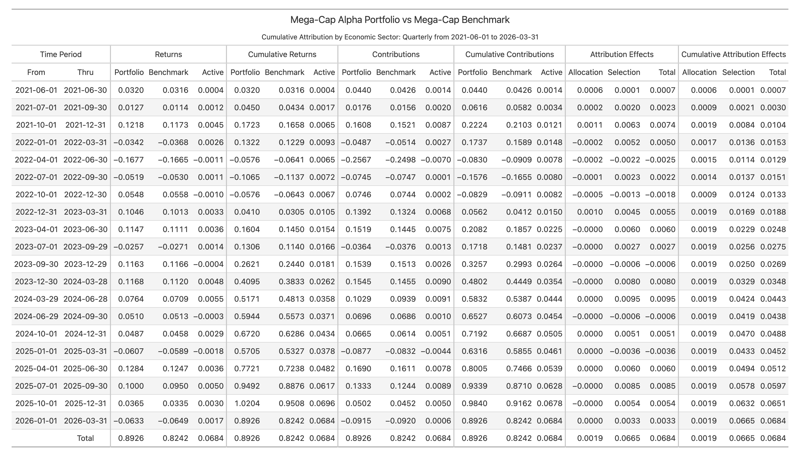
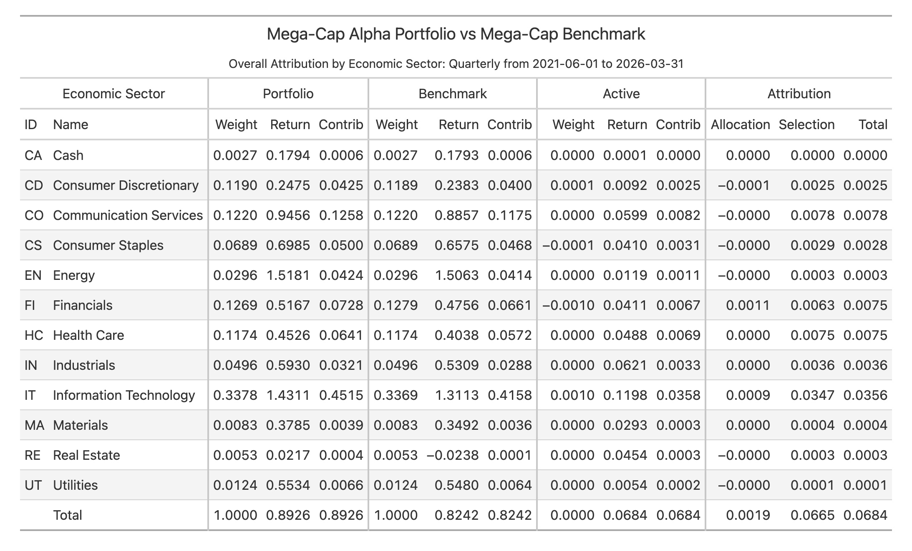
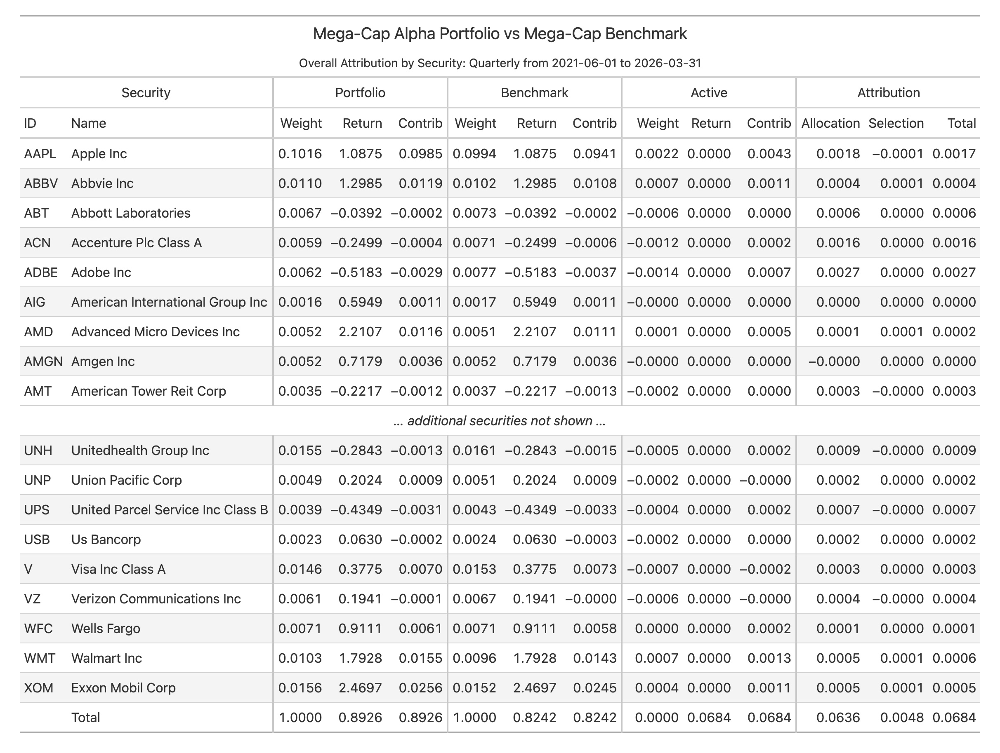
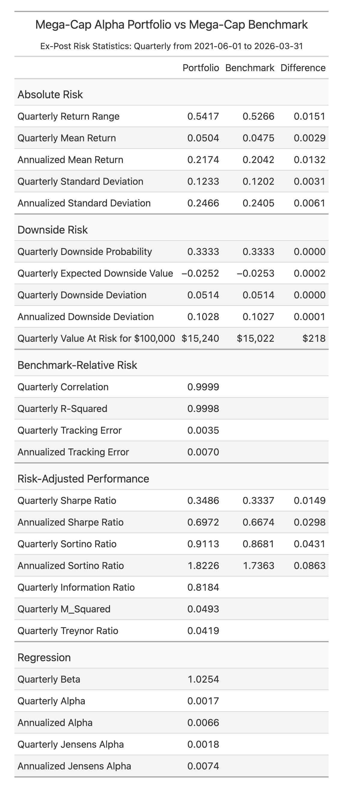

# Portfolio Performance Analytics

Portfolio Performance Analytics (`ppar`) is a Python package for explaining
investment performance. It has two main workflows:

| Feature | Question It Answers |
| --- | --- |
| **Analytics** | Why did this portfolio outperform or underperform its benchmark? |
| **Performance Comparison** | Why did reported performance change between two source-data snapshots? |

[License](LICENSE)

## Table of Contents

- [Description](#description)
- [Features](#features)
- [Inputs](#inputs)
- [Outputs](#outputs)
- [Installation](#installation)
- [Usage](#usage)
- [Performance Comparison](#performance-comparison)
- [Repository Guide](#repository-guide)
- [Technical](#technical)
- [Enhancements](#enhancements)
- [Support](#support)

---

## Description

portfolio-performance-analytics is a python package (https://pypi.org/project/ppar/) that produces holdings-based multi-period performance attribution, contribution, and benchmark-relative ex-post risk statistics. It uses the Brinson-Fachler methodology for calculating attribution effects, and uses the Carino method for logarithmically-smoothing cumulative effects over multi-period time frames.

---

## Features

The sample outputs below portray a Mega-Cap alpha portfolio measured against a
Mega-Cap benchmark. The rendered reports show quarterly attribution and risk from
June 2021 through March 2026.

Over the full period, the portfolio returned 89.3% versus 82.4% for the
benchmark, producing an active return of about 684 bps. In the total line of
the Economic Sector Attribution reports, that active return is explained mostly
by security selection: about 19 bps from sector allocation and about 665 bps
from security selection. Information Technology was the largest source of active
performance, contributing about 351 bps of total attribution effect.

The Risk Statistics report shows a similar but modest risk-adjusted advantage:
annualized Sharpe ratio of 0.70 for the portfolio versus 0.67 for the benchmark,
and annualized Sortino ratio of 1.82 versus 1.74.

<!--
Image sources are repository-relative so they render for authorized GitHub
viewers when this repository is private. PyPI cannot render these private
assets; public image URLs are required there if image display is needed.
-->

- **Attribution & Contribution**:

<br><br><br>

<br><br><br>

<br><br><br>

<br><br><br>

<br><br><br>

<br><br><br>

<br><br><br>

<br><br><br>

<br><br><br>

<br><br><br>

<br><br><br>

- **Ex-Post Risk Statistics**:

<br>

---

## Inputs

The inputs required to produce the analytics fall into three categories:
1. Periodic "classification-level" weights and returns for a portfolio and its benchmark.  A "classification" can be any category such as region, country, economic sector, industry, security, etc.  The weights and returns must satisfy the formula: *SumOf(weights * returns) = Total Return*. They will typically be from-of-period weights and period returns. (Required)
2. Classification items and descriptions. (Optional)
3. Mappings from the classification scheme of the weights and returns to a reporting classification. (Optional)

The input data may be provided directly as either:
1. Pandas DataFrames.
2. Polars DataFrames.
3. Python dictionaries (for Classifications and Mappings).
4. csv files.

Portfolio and benchmark performance sources use narrow rows. The `name` column
is optional; `contribution` and total return are calculated by the package.

```csv
from_date,thru_date,identifier,weight,return,name
2023-12-31,2024-01-31,AAPL,0.4,-0.0422272121,Apple Inc.
2023-12-31,2024-01-31,MSFT,0.6,0.0572811503,Microsoft
```

Wide performance files with per-identifier columns such as `AAPL.ret` and
`AAPL.wgt` are not supported.

For sample input data sources, please refer to the ``ppar-analytics-demo``
command and the ppar/demos/data directory. Once the input data has been
provided, then the analytics may be requested using different calculation
parameters, time-periods, and frequencies:
1. Daily (or for whatever data frequency is provided).
2. Monthly
3. Quarterly
4. Yearly

Typically, a user will develop their own "data source" functions that provide
the data in one of the above formats. The ``ppar-analytics-demo`` command uses
sample data source functions.

---

## Outputs

The outputs are represented by different views and charts.  See [Features](#features) above.  They may be delivered in different formats:
1. csv files
2. html strings
3. json strings
4. Pandas DataFrames
5. png files
6. Polars DataFrames
7. Lightweight Python HTML table objects
8. xml strings

The ``to_html()`` methods return complete HTML document strings. The ``to_table()`` methods return lightweight table objects whose ``as_raw_html()`` method can emit either a complete HTML document or a table fragment. Users can also develop their own "presentation layer" using the various output formats as the inputs to their presentation layer.

---

## Installation
pip install ppar

---

## Usage
Run the bundled demos from an installed environment:

```bash
ppar-analytics-demo
ppar-axys-analytics-demo
ppar-performance-comparison-portfolio-demo
ppar-performance-comparison-security-demo
```

The analytics demo commands default to quarterly reporting. Pass `--frequency monthly`,
`--frequency quarterly`, or `--frequency yearly` to change the reporting
frequency; the short forms `m`, `q`, and `y` are also accepted.

---

## Performance Comparison

The performance comparison feature compares two source-data snapshots and helps
explain why reported performance changed between extraction dates. Portfolio
comparison uses `portfolio_performance` as the primary result dataset; security
comparison uses `security_performance` as the primary result dataset. Both paths
can use normalized transactions, holdings, FX rates, cash, and
security-reference data, then write a review bundle with HTML, CSV, manifest,
and XLSX workbook artifacts.

Before a user-facing review bundle is written, every changed source-data field
that ppar knows how to classify must be explicitly configured in YAML as
additive, evidence-only, or suppressed. Missing YAML is a hard stop, so workbook
statuses such as `Partly Explained` and `Unexplained` are reserved for complete
YAML configurations where visible differences are intentionally review-only or
not additively estimated.

The packaged portfolio and security demos share one YAML file:
`ppar/demos/data/axys/ppar_performance_comparison.yaml`. It maps native
lower-case transaction codes such as `by`, `sl`, `dv`, `in`, `dp`, `wd`, and
`;` to normalized transaction categories used by the comparison logic.

Use these entry points:

- [Packaged Axys Demo Matrix](ppar/demos/data/axys/README.md): recommended
  workbook demo command, packaged YAML fixtures, data used, and expected XLSX
  output.
- [Repository Guide](docs/repository_guide.md): map of README files, commands,
  validators, generated outputs, and common workflows.
- [Performance Comparison Roadmap](docs/performance_comparison_roadmap.md):
  central plan for return reconstruction, reviewer explanations, report
  evolution, and demo-data guardrails.
- [Performance Comparison Demo Source Contract](docs/performance_comparison_demo_source_contract.md):
  how the packaged demo CSV files should be interpreted relative to the Axys/APX
  reference docs.
- [Performance Comparison Design Notes](docs/performance_comparison_design.md):
  internal model, YAML vocabulary, attribution setup, and report/workbook
  design rationale.
- [Axys Common-Core Export Reference](docs/axys_common_core_export.md): starter
  Axys export template and field-reference tables.

Source-checkout smoke test:

```bash
./.venv/bin/python -m ppar.demos.performance_comparison_portfolio_demo
./.venv/bin/python -m ppar.demos.performance_comparison_security_demo
```

For the full packaged performance-comparison demo guardrail pass, run:

```bash
./.venv/bin/python scripts/check_performance_comparison_demo_health.py
```

Generated demo artifacts live under `_demo_output/analytics`,
`_demo_output/axys_analytics`, `_demo_output/performance_comparison_portfolio`,
and `_demo_output/performance_comparison_security`. The core analytics demo and
the Axys analytics demo use the same Mega-Cap Alpha portfolio and benchmark;
the Axys demo reads the data through Axys-shaped exports before handing the
same analytics object shape to the shared renderer. Both analytics demos use
quarterly reporting and write tables and charts. All demos write files and
print the review paths instead of opening browser windows automatically. The
performance comparison demos write both `report.xlsx` and `report.html`; start
review in the generated `report.xlsx`.

---

## Repository Guide

If the README files, demo fixtures, commands, validators, and tests start to feel
too scattered, start with the [Repository Guide](docs/repository_guide.md). It
maps the major directories, explains which README owns which topic, summarizes
the source-checkout commands and installed commands, and gives common workflows
for generating and validating performance comparison reports and XLSX
workbooks.

---

## Technical
Being built on top of Polars dataframes, ppar is able to efficiently process large datasets through parallel processing, vectorization, lazy evaluation, and using Apache Arrow as its underlying data format.

Run local project checks from a source checkout with the repository virtual
environment:

```bash
./.venv/bin/python scripts/check_project.py
```

For faster routine feedback during small changes:

```bash
./.venv/bin/python scripts/check_project.py --quick
```

To include a temporary wheel and source-distribution build check:

```bash
./.venv/bin/python scripts/check_project.py --build
```

---

## Enhancements
Future enhancements may include:
1. Break out the interaction (cross-product) effect.  It is currently included in the selection effect.
2. Break out the currency effect.
3. Break out the long and short sides.
4. Add additional multi-period smoothing algorithms (e.g. Menchero).
5. Support time-series of risk-free rates (as opposed to a single annual rate).
6. Calculate additional risk statistics.

---

## Support
If you find this project helpful, consider sponsoring it at https://github.com/sponsors/JohnDReynolds to help keep it going!
