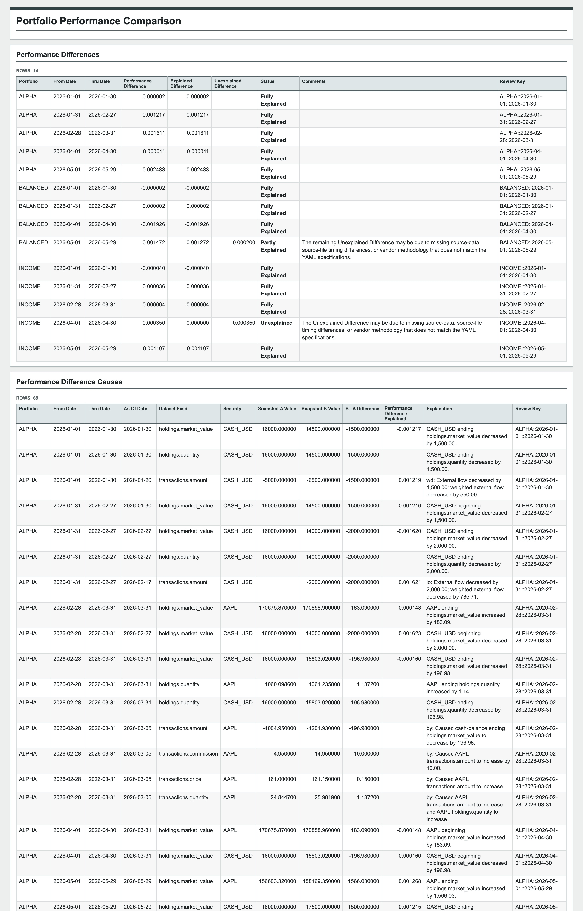
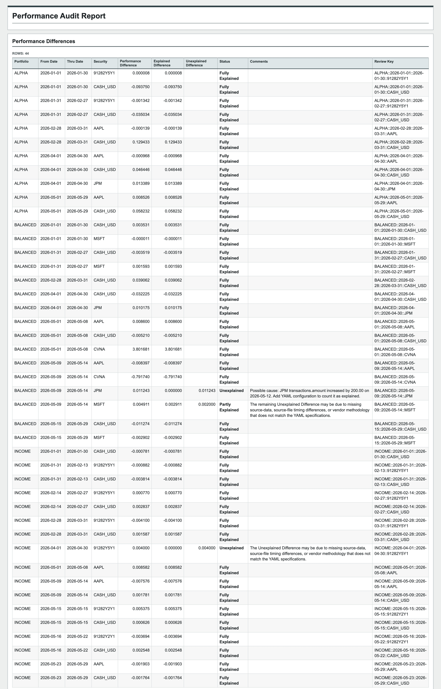

# PPAR

PPAR uses local Axys/APX data extracts for two main workflows: Performance Auditing and Performance Analytics.

1. Everything runs locally, so your data stays inside your environment.  No internet connection is needed.
2. You can generate standard charts, xlsx, and html output.
3. Being built in Python, it is highly customizable.  You can automate batch runs and produce custom output in CSV, Pandas, Polars, JSON, and XML formats.

[License](LICENSE)

---

## Performance Auditing

Use Performance Auditing to answer the question: "Why did my reported performance change?"  It answers this question by:
1. Determining the differences in reported performance for each time-period/portfolio/security.
2. Quantitatively attributing these performance differences to changes in the underlying holdings and transaction source-data.
3. Flagging suspicious source-data relationships such as price ranges, dividend rates, accrued-interest rates, missing dividends, and holding value math.

Typical questions:
- Which portfolio or security returns changed?
- Which holdings or transactions explain the change?
- Which differences still need human review?
- Are there data-quality issues that might explain suspicious results?






---

## Performance Analytics

Use Performance Analytics when you want a clean explanation of performance
versus a benchmark. It includes:

- **Performance Attribution:** Brinson-Fachler attribution, Carino-smoothed
  multi-period effects, and contribution views.
- **Ex-Post Risk:** ex-post risk statistics calculated from realized returns.

Typical questions from the Mega-Cap Alpha vs Mega-Cap Benchmark demo:

- Did Mega-Cap Alpha outperform? Yes. The portfolio returned about 89.3%
  versus 82.4% for the benchmark, or roughly 684 bps of active return.
- Was outperformance mostly allocation or selection? Mostly selection. The
  overall sector attribution view shows about 19 bps from allocation and about
  665 bps from selection.
- Which area drove the result? Information Technology was the largest positive
  contributor, with roughly 351 bps of total attribution effect.
- Did the portfolio take more risk? Slightly, but risk-adjusted results still
  improved: Sharpe was about 0.70 versus 0.67, and Sortino was about 1.82
  versus 1.74.


---

## Setup

Start by creating a local starter workspace. The starter data lets you run a
full demo before replacing the demo data with your own data exports.

```bash
pip install ppar
ppar setup ./my_ppar_data
```

Then run the two demos:

```bash
ppar performance_audit ./my_ppar_data/performance_audit
ppar analytics ./my_ppar_data/analytics
```

To customize with your own data, follow the `Customizing` section in `./my_ppar_data/README.md`.

```text
my_ppar_data/
  README.md
  performance_audit/
    ppar.yaml
    run_performance_audit.py
    snapshot_a/
      portperf.csv
      holdings.csv
      transactions.csv
      secperf.csv
    snapshot_b/
      portperf.csv
      holdings.csv
      transactions.csv
      secperf.csv
  analytics/
    ppar.yaml
    portperf.csv
    secperf.csv
    run_analytics.py
```

---

## Inputs

The input data files are typically IMEX-style CSV exports:

- portfolio performance
- security performance
- holdings
- transactions

Performance Auditing uses two source-data snapshots, usually an older/original
snapshot and a newer/restated snapshot.

Performance Analytics uses portfolio performance and security performance exports.

PPAR normalizes these files using a customizable YAML configuration so that each site can configure its own local field names, transaction-code treatment, and report assumptions.

---

## Outputs

Performance Auditing writes review packages:

```text
performance_audit/output/
  portfolio/report.xlsx
  portfolio/report.html
  security/report.xlsx
  security/report.html
```

Performance Analytics writes attribution and ex-post risk reports and chart images:

```text
analytics/output/
  security_overall_attribution.html
  sector_overall_attribution.html
  sector_cumulative_attribution.html
  risk_statistics.html
  *.png
```

The Python API can also return CSV, Pandas, Polars, JSON, and XML formats for Analytics result tables.
