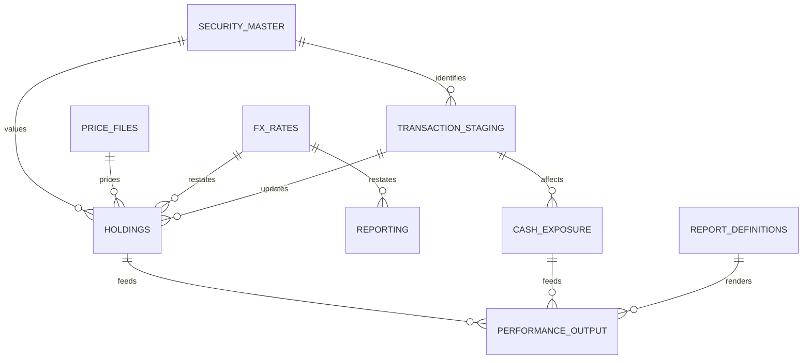
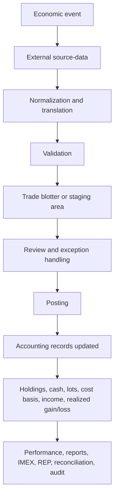

# Axys/APX IMEX Schema and Cash Modeling

**Evidence file:** `Research_17A_Multi_Currency_Cash_Provenance.md`  
**Original intake file:** `_temp_deep-research-report.md`  
**Merged:** 2026-07-13  
**Target chapter:** `../reference/Chapter_17_Multi_Currency.md`  
**Status:** AI-assisted research synthesis; not vendor documentation

> **Citation boundary:** Tokens such as `turn25view0` and `turn0file1` were
> generated inside the originating ChatGPT research session and are not
> durable citations in this repository. Use this file for its explicitly
> qualified cash-provenance reasoning. Trace material claims to the existing
> subject research files before promoting them beyond `Unknown`, configurable
> inference, or connector-specific evidence.

## Executive summary

Publicly available evidence is **sufficient to implement a narrow, defensible audit model for cash provenance and multi-currency cash effects**, but **not sufficient to reproduce native Axys or APX accounting internals, nor to prove exact source/destination bank-account provenance in all cases**. The evidence base splits cleanly into two layers.

At the **official-vendor layer**, Axys/APX are clearly described as multi-currency portfolio accounting and reporting platforms. The current public Axys brief says Axys can restate reports in any currency, define and track **trading, income, and risk currencies** for each security, bifurcate return components between **market-price** and **currency-rate** effects, and import **spot and forward exchange rates** through data interfaces. It also states that Axys supports security types including **money market and other cash types**, and supports **trade-date or settlement-date accounting**. APX’s current public materials describe it as a centralized book of record with **holdings, transactions, cash, and performance**, with **settlement in any currency**, multi-currency/multi-asset support, reconciliation, and reporting capabilities. citeturn25view0turn16view0turn26view0turn25view1

At the **implementation-evidence layer**, the strongest public detail is not official IMEX schema documentation but partner and integration behavior summarized in the uploaded Axys/APX reference repository. That corpus consistently shows public evidence for artifacts such as `sec.inf`, `type.inf`, `topost.trn`, `ptopost.trn`, `.pos`, `.pri`, and `.REP`; for transaction-context tokens such as `SRC/DEST TYPE`, `SRC/DEST SYMBOL`, `$cash`, `$income`, `CAUS`, `CASH`, `MMF`, `MARGIN`, and `SHORT`; and for Axys integration parameters such as `axyscur`, `defmarkmarket`, and `defperfcw`. At the same time, the repository repeatedly warns that **complete native IMEX catalogs, authoritative field dictionaries, and stored-versus-calculated performance behavior remain unknown**. fileciteturn0file1L20-L27 fileciteturn0file1L37-L46 fileciteturn0file2L147-L156 fileciteturn0file4L63-L71

For the specific question **“when I see a BY transaction for a stock, how do I know where the cash is coming from?”**, the answer is:

- **Sometimes directly**: in public integration/staging examples, a `by` row may carry **source/destination type and symbol** fields such as `caus,cash`.  
- **Often only indirectly**: in the broader Axys/APX public corpus, there is **no authoritative standard field proving an exact source cash account or bank account**. In those cases, the safest inference is that the buy is funded by the portfolio’s cash exposure in the relevant currency, and the exact cash security or bucket must be inferred from source/destination tokens, security currency, holdings changes, and any related FX or sweep/journal rows.  
- **Sometimes not provably at all**: if multiple cash buckets exist and no staging or holdings evidence disambiguates them, a rigorous audit product should label the cash provenance **unknown** rather than over-assign it. fileciteturn0file3L1413-L1440 fileciteturn0file4L96-L99 fileciteturn0file8L191-L198

The most practical implementation conclusion is this: **build an audit product that treats cash provenance as an inference problem, not a guaranteed native field.** Use explicit evidence when present; otherwise infer conservatively by currency and cash-security movement; and preserve an “unknown provenance” state when the source-data do not prove the answer. fileciteturn0file1L20-L27 fileciteturn0file4L173-L178

## Evidence base and scope of what is actually documented

The official public evidence is materially stronger on **capabilities** than on **schema mechanics**. The current Axys product brief is unusually useful because it states several exact multi-currency behaviors: it says Axys supports money market and other cash types, allows trade-date or settlement-date accounting, can restate reports in any currency, can automatically calculate international withholding tax, can bifurcate returns into market-price and currency-rate components, can define and track trading, income, and risk currencies for each security, and can populate files with domestic/international prices and **spot and forward exchange rates**. citeturn25view0

The current APX public materials are also clear on capability, though less detailed on cash internals. They describe APX as an integrated platform and centralized book of record for portfolio management, performance measurement, accounting, and reporting; say it tracks **holdings, transactions and performance**; say users gain insight into **portfolios, positions, cash and performance**; and state that APX supports broad asset classes with **settlement in any currency**. citeturn16view0turn26view0turn25view1

What the public evidence **does not** establish is equally important. The uploaded Axys/APX repository explicitly warns against treating report labels as native fields, against assuming IMEX object names without evidence, and against assuming stored-versus-recalculated performance semantics. It also flags multi-currency behavior as under-evidenced for implementation purposes. Those warnings are not incidental; they are the key constraint for any serious audit tool. fileciteturn0file1L20-L27 fileciteturn0file1L37-L46

The resulting evidence hierarchy for this report is:

| Tier | Source type | What it supports well | What it does not support well |
|---|---|---|---|
| Tier 1 | Official Advent/SS&C public product pages, resource briefs, previews | Product capabilities, multi-currency feature claims, reporting scope, security-currency concepts | Field-level IMEX schema, native transaction layouts, exact cash-account fields |
| Tier 2 | Public partner/integration evidence summarized in the uploaded repository, especially CI/AIA/conversion notes | Concrete artifacts, observed staging rows, source/destination tokens, practical workflow behavior | Proof that those staging rows are the full native schema |
| Tier 3 | Consultant and implementation notes summarized in the repository | Scripts like `mergepri`, practical warnings, historical patterns | Authoritative vendor behavior |

That distinction drives the rest of the analysis. Where the official corpus is silent, I mark the result as **unknown** or **inference**, not fact. fileciteturn0file1L20-L27

## Publicly evidenced schema surfaces and file artifacts

The public corpus does **not** yield a full Axys/APX IMEX object catalog. It does, however, yield a useful set of **evidenced artifacts** that are enough to orient an audit implementation.

### Evidenced artifacts, not a full IMEX catalog

| Platform | Artifact | Publicly evidenced role | Key field visibility in public corpus | Implementation value |
|---|---|---|---|---|
| Axys | `sec.inf` | Security information export/import artifact | Field layout unknown | Strong signal that security master is file-oriented in some workflows |
| Axys | `type.inf` | Security type information artifact | Field layout unknown | Important for symbol+type matching |
| Axys | `topost.trn` | Transaction/trade blotter staging/import artifact | Partial row examples only | Most important public transaction surface |
| Axys | `ptopost.trn` | Position import artifact | Layout unknown | Useful for holdings pipelines |
| Axys | `.pos` | Positions artifact | Layout unknown | Indicates position-post workflow |
| Axys | `.pri` | Price artifact | Layout unknown | Important for valuation and FX-related valuation checks |
| Axys | `.REP`, `REP32.exe` | Report writer/extraction surface | Report-specific fields unknown | Important fallback when IMEX is incomplete |
| APX | `sec.inf`, `type.inf` | Publicly referenced security/security-type artifacts in integration context | Field layout unknown | Shows similar security-master abstractions exist in practice |
| APX | `ACCTX` rows in AIA examples | Transaction staging/example rows | Partial row examples only | Strongest public APX cash-context evidence |
| APX | `.pri` / price-set logic | Price import/update workflow | Field names partly observed, native schema unknown | Important for custody/source-specific pricing |

The repository’s overview chapter lists exactly these artifacts and warns that they are **observed workflow artifacts**, not a complete native spec. fileciteturn0file1L232-L247 fileciteturn0file2L118-L129

### Key transaction and cash-context fields that are actually evidenced

The strongest public transaction-context evidence is not a clean “Axys native schema,” but a repeated pattern of fields and tokens:

- **Transaction code**
- **Security type**
- **Security symbol**
- **Quantity**
- **Source/destination type**
- **Source/destination symbol**
- **Amount**
- In Axys integration context, **Mark to Market** and **Perf/CW**
- In APX integration context, `Src/Dest Type`, `Src/Dest Symbol`, and “special security” fields

That evidence is explicit in the uploaded transaction and cash chapters. fileciteturn0file3L632-L649 fileciteturn0file4L63-L71 fileciteturn0file4L216-L228

### Entity relationship diagram



This lifecycle and dependency map is consistent with the repository’s architecture overview and transaction chapter: economic events flow into transaction staging, are validated and posted, then update holdings, cash, lots, cost basis, income, and realized gain/loss before surfacing through reports, IMEX, REP, and performance outputs. fileciteturn0file3L49-L70

## Cash representation and multi-currency modeling

### What the official Axys material says

The Axys product brief is explicit that Axys supports:

- money market and other cash types,
- trade-date or settlement-date accounting,
- multicurrency reporting,
- report restatement in any currency,
- international withholding tax calculation,
- return bifurcation between market-price and currency-rate effects,
- security-level trading, income, and risk currencies,
- and import of spot and forward FX rates via data interfaces. citeturn25view0

That is enough to conclude that in Axys, multi-currency is not a superficial reporting toggle. The product model explicitly distinguishes multiple currency concepts at the security level and treats FX data as operational data, not just display formatting. What the official brief does **not** say is how those concepts are stored in IMEX, what the field names are, what the quote convention is, or how historical corrections propagate. Those mechanics remain under-evidenced. citeturn25view0 fileciteturn0file1L37-L46

### What the public Axys/APX implementation corpus says

The uploaded cash chapter supports several important implementation facts:

- Axys integration tooling references a configured **system currency** through `axyscur`.
- Non-system-currency Axys transactions may require a **Mark to Market** value via `defmarkmarket`.
- A `Perf/CW` column exists in public Axys `topost.trn` integration context.
- Native Axys cash-balance presentation by currency is still **unknown** from the public corpus.
- Exchange-rate source, valuation date, and local-versus-base cash fields are also **unknown** in the public corpus. fileciteturn0file4L63-L71 fileciteturn0file4L92-L99

For APX, the public corpus confirms multi-currency/multi-asset coverage and “settlement in any currency” in official product material, but it does **not** publicly establish a standard APX cash-ledger schema or standard public fields analogous to all of Axys’s integration parameters. The repository explicitly leaves APX equivalents for Axys `topost.trn`, `Perf/CW`, and Mark-to-Market fields as **unknown**. citeturn26view0turn25view1 fileciteturn0file4L142-L145

### Is foreign cash represented as a security?

The best public answer is: **often yes in practice, but not with an authoritative public vendor naming convention**.

The common-core export note in the uploaded repository says cash balances are “often derivable from holdings if cash is represented as security rows.” That is not official vendor schema documentation, but it is the strongest implementation-oriented public statement in the supplied corpus. The demo source contract then adds an important guardrail: when a transaction affects cash but the source row does not prove the exact cash security, explanations should refer to the changed cash balance rather than claim a specific cash security. fileciteturn0file7L61-L63 fileciteturn0file8L191-L198

This leads to the right implementation stance:

- treat **“cash as security rows”** as a valid and common modeling pattern;
- do **not** hard-code a vendor-standard cash security naming convention from public material;
- require a site-specific mapping or infer cash-like rows from security master, holdings, type, description, and currency.

That means identifiers like `CASHEUR`, `CASH_EUR`, or `EUR` should be treated as **illustrative placeholders**, not as documented Advent standards. The public corpus supports **cash-like tokens** such as `CASH`, `MMF`, `MARGIN`, `SHORT`, `$cash`, and `$income`, but it does not publish a standard multi-currency cash-security naming rule. fileciteturn0file4L216-L228

### Practical naming-convention conclusion

| Question | Best-supported answer |
|---|---|
| Is there a documented vendor-standard Axys cash-security ID convention such as `CASHEUR`? | No public evidence in the corpus establishes one. |
| Is “cash as security rows” a defensible implementation model? | Yes, as an implementation pattern, but not as a universal vendor rule. |
| Should an audit tool assume `CASHEUR` over `CASH_EUR` or `EUR`? | No. Require configuration or infer from local security master/holdings. |
| Are generic cash-like symbols documented publicly? | Yes: `CASH`, `MMF`, `MARGIN`, `SHORT`, `$cash`, `$income`, `CAUS`. |

### Sample observed cash-like examples

The cash chapter includes public WealthTechs AIA examples like:

```text
DP,CAUS,CASH,CAUS,MMF
```

and

```text
ACCTX,010117,LI,100,100,CAUS,MMF,CAUS,CASH
ACCTX,010117,LO,100,100,CAUS,MMF,CAUS,CASH
ACCTX,010117,DP,100,100,CAUS,MMF,CAUS,CASH
ACCTX,010117,WD,100,100,CAUS,MMF,CAUS,CASH
```

The chapter explicitly warns not to infer the full native layout from these rows, but they are still useful because they show the public pattern: **code + amount/quantity + type/symbol pair(s)** rather than a dedicated public “cash account id” field. fileciteturn0file4L337-L370

## Transaction source and destination, and how to infer cash provenance for BY transactions

### The strongest public BY example

The uploaded transaction chapter includes this public third-party row:

```text
acct123,010101,010101,by,csus,appl,100,caus,cash,10000
```

and a cancellation variant:

```text
acct123,010101,010101,BY,csus,appl,100,caus,cash,10000
```

Its tentative interpretation is:

- account / portfolio
- two date fields
- transaction code `by` / `BY`
- security type
- security symbol
- quantity
- source/destination type
- source/destination symbol
- amount

The chapter then immediately warns: **“This row is not a complete Axys/APX import layout.”** That caveat matters. It means the row is valuable evidence that public integration layouts can carry cash-context fields, but it is **not** proof that standard posted Axys transactions always contain an explicit, queryable source cash account field. fileciteturn0file3L1413-L1440

### What can be said rigorously about BY

The public corpus supports three increasingly weaker levels of inference for a `BY` transaction.

#### Explicit provenance

If the source row includes **source/destination type and symbol** and those values are clearly cash-like, that is your strongest available provenance. In the public example above, `caus,cash` tells you the buy is being represented against a cash-like leg. In APX integration evidence, the analogous strongest public fields are `APX Transaction Src/Dest Type` and `APX Transaction Src/Dest Symbol`. fileciteturn0file3L1413-L1440 fileciteturn0file3L632-L649

#### Currency-level provenance

If the row lacks explicit cash-leg fields but the security’s trading currency is known, the safest inference is that the buy is funded from the portfolio’s cash exposure in that currency, or from a related FX/settlement chain if the portfolio did not already hold that currency. This is an **inference**, not a published Axys formula, but it is strongly motivated by the official Axys brief’s statement that Axys tracks **trading, income, and risk currencies per security**, supports FX rates operationally, and supports return bifurcation between local market and currency effects. citeturn25view0

#### Holdings-delta provenance

If neither explicit cash-leg fields nor a single clear cash currency is available, the most defensible audit method is to reconcile the `BY` to **holdings-side cash movement**:

- identify cash-like holdings rows,
- match by portfolio and date/period,
- compare cash movement in the expected currency,
- account for related FX, sweep, journal, or reinvestment rows,
- and decline to assign the buy to a specific cash security when multiple candidates remain.

This approach is explicitly aligned with the source contract’s warning not to assign a transaction to a specific cash security when the source-data do not prove it. fileciteturn0file8L191-L198

### What the public evidence does **not** prove

The public corpus does **not** establish:

- a standard Axys field named `source_cash_account`,
- a standard Axys field named `destination_cash_account`,
- a public APX field named `settlement_account` or `custody_account` for this purpose,
- a standard public bank-account identifier carried through posted transactions,
- or a universal rule that `BY` must always contain explicit cash-leg fields in native storage.

Instead, it shows that **cash/source-destination context may exist in staging and translation workflows**, and that public partner tools rely heavily on it for interpretation. fileciteturn0file3L138-L157 fileciteturn0file4L188-L188

### Axys versus APX on source/destination fields

| Topic | Axys | APX | Best-supported conclusion |
|---|---|---|---|
| Source/destination fields visible in public corpus | Yes, in integration/staging examples | Yes, in observed APX blotter/translation fields | Both systems show public staging-level source/destination context |
| Explicit canonical posted cash-account field proven publicly | No | No | Unknown in the public corpus |
| Settlement-in-any-currency claim | Officially supported via multi-currency reporting and FX interfaces | Officially supported | Capability supported; field mechanics under-evidenced |
| Custody/settlement account field names | Not publicly established | Not publicly established | Treat as client-specific until proven |
| Cash provenance for `BY` | Sometimes explicit in staging rows, otherwise inferred | Same | Build inference rules, not hard-coded certainty |

The APX brief’s “settlement in any currency” claim is operationally significant, but it still does not expose schema-level account identifiers. Public APX implementation evidence bottoms out at source/destination type/symbol fields, not canonical custody-account schema. citeturn26view0 fileciteturn0file3L632-L649

### Transaction lifecycle flowchart



This lifecycle comes directly from the repository’s transaction chapter and explains why cash provenance is often strongest **before** final posting, in translation or blotter data, rather than after the fact in report outputs. fileciteturn0file3L49-L70

## Recommended audit logic for a production-quality inference model

### Baseline design principle

A robust audit product should distinguish four confidence levels for cash provenance on a `BY` transaction:

| Level | Meaning | When to use |
|---|---|---|
| Proven | Exact cash leg or cash security is explicitly present | Staging row carries reliable source/destination cash fields |
| Strongly inferred | Cash bucket is not explicit but only one currency-consistent cash holding moved accordingly | Single-candidate currency and holdings delta |
| Weakly inferred | Cash likely came from portfolio cash in relevant currency, but multiple cash buckets exist | Multi-bucket or sweep-heavy environment |
| Unknown | Public source-data do not prove source cash bucket | Multiple candidates, missing holdings, missing FX chain, or contradictory signs |

That model is consistent with the repository’s constant warning not to overstate unknowns as facts. fileciteturn0file1L20-L27

### Concrete audit checks

| Check | Why it matters | Evidence basis |
|---|---|---|
| Detect cash-like securities/tokens from security master and holdings, not by hard-coded names | There is no public vendor-standard naming rule like `CASHEUR` | fileciteturn0file7L61-L63 fileciteturn0file4L216-L228 |
| For `BY`, prefer explicit source/destination type/symbol when present | Strongest public provenance evidence | fileciteturn0file3L1413-L1440 |
| Classify `BY` as trade activity, not external flow | Prevents false contribution/withdrawal treatment | fileciteturn0file3L1696-L1704 |
| Infer currency of funding from security trading currency only when explicit cash-leg fields are absent | Matches official Axys multi-currency design intent | citeturn25view0 |
| Reconcile `BY` against cash-like holdings deltas in the same period | Best fallback when exact account is not explicit | fileciteturn0file8L191-L198 |
| Require separate FX evidence for cross-currency buys | Do not silently assume internal conversion path | citeturn25view0turn26view0 |
| Do not rely on `li`/`lo`/`dp`/`wd` by code alone | These codes are context-dependent and can represent sweeps, fees, transfers, or other activity | fileciteturn0file3L138-L157 fileciteturn0file4L173-L178 |
| Treat sweep-removal and intra-account journal netting as integration behavior unless client evidence proves native handling | Prevents importing AIA/CI behavior as universal Axys/APX truth | fileciteturn0file4L75-L81 |
| Preserve unknown state when exact cash security is not proven | Avoids false precision in audit output | fileciteturn0file8L191-L198 |

### Recommended field model for an audit product

A conservative normalized model should include:

- portfolio id
- trade date
- settlement date when available
- transaction code
- security id
- security type
- quantity
- amount / net amount
- transaction currency when available
- source/destination type
- source/destination symbol
- special security type/symbol
- cash provenance confidence
- inferred cash currency
- inferred cash security
- FX-link status
- provenance notes

This aligns with the repository’s common-core export and design docs, while remaining careful not to claim native field names that the public corpus does not verify. fileciteturn0file7L97-L133 fileciteturn0file9L263-L281

### What to mark as unknown in a serious implementation

An implementation should explicitly leave the following as **unknown unless a client proves them**:

- exact Axys or APX IMEX object names for performance and cash,
- exact native field names for transaction currency and settlement currency,
- exact public schema for local vs base market value and FX valuation rate,
- exact stored-versus-recalculated performance behavior,
- exact APX custody or settlement account identifiers,
- exact Axys/APX rule for allocating the interaction term in currency bifurcation,
- exact bank-account-level source/destination provenance for a `BY` row.

The repository is very clear that these are current blockers for stronger vendor-native claims. fileciteturn0file1L37-L46 fileciteturn0file6L103-L112

## Analytical conclusion

The public evidence supports the following narrow but robust conclusion.

**Axys/APX both publicly support multi-currency accounting/reporting, and public partner/integration evidence shows transaction rows can carry cash-leg context through source/destination tokens.** That is enough to build a serious audit tool that can often infer the cash provenance of a `BY` transaction to the correct **cash bucket or currency exposure**. citeturn25view0turn26view0turn16view0 fileciteturn0file3L1413-L1440

But the same evidence also shows the limit: **the public corpus does not establish a canonical native field that always tells you the exact source cash account or exact cash security.** It does not establish a vendor-standard naming convention for multi-currency cash securities, and it does not establish a fully authoritative IMEX field dictionary. As a result, the right posture for an audit product is not “recreate Advent,” but rather:

- consume the strongest explicit evidence available,
- infer conservatively when only currency- or holdings-level evidence exists,
- and say **unknown** when the source does not prove more. fileciteturn0file1L20-L27 fileciteturn0file1L37-L46 fileciteturn0file8L191-L198

That is the most defensible model for portfolio-accounting cash auditing from public Axys/APX evidence: **strong enough for explanation and exception detection, but not strong enough to guarantee exact account-level provenance unless the client’s own exports provide it.**
